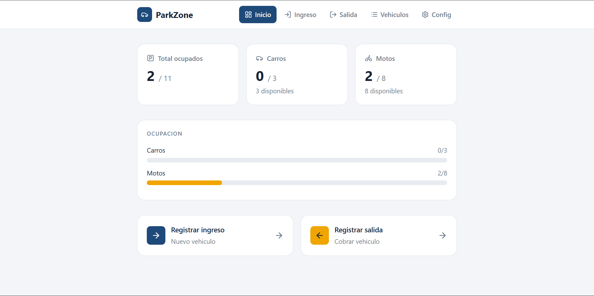
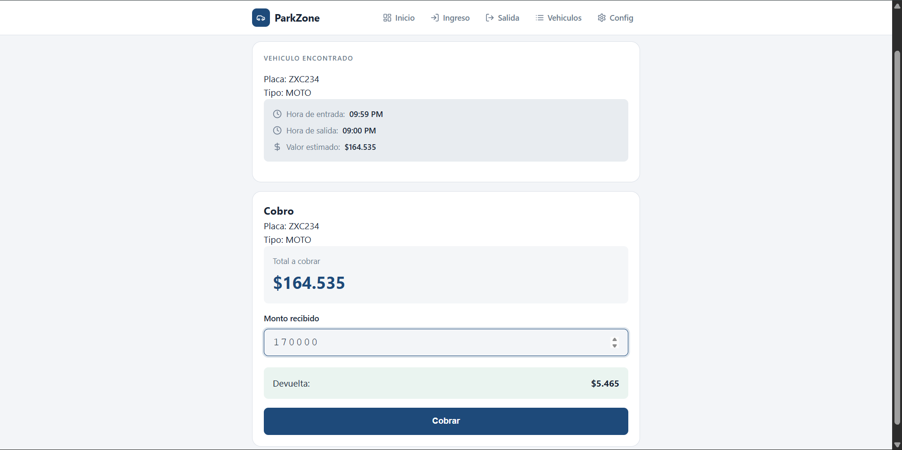
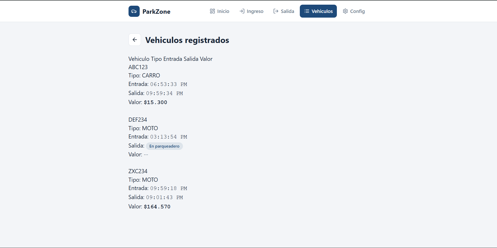

<<<<<<< HEAD
# ParkingApp
=======
<<<<<<< HEAD
<h1 align="center">🚗 Parking Management System</h1>

  Sistema web para gestión de parqueaderos con cálculo automático de tarifas
   
  Web-based parking management system with automatic billing

  <strong>Prototype • Portfolio Project • Ready for Real Adaptation</strong>

---

## 🎥 Demo en video / Video Demo

👉 <a href="https://youtu.be/R0sLJhkzdNI" target="_blank">
Ver demostración completa / Watch full demo
</a>

---

## 🖼️ Capturas de pantalla / Screenshots

### 🚦 Registro de ingreso / Vehicle Entry

  

---

### ⏱️ Dashboard

  

---

### 💰 Proceso de cobro / Billing Process

  

### 🚗 Vehículos / vehicles

  

### ✅ Configuración / configuration

  

---

## 🇪🇸 Español

### 📌 Descripción

Aplicación web desarrollada para gestionar un parqueadero de vehículos (carros y motos), permitiendo:

- Registrar entradas por placa
- Controlar cupos disponibles
- Calcular tiempo de permanencia
- Calcular tarifas por horas y minutos
- Registrar salidas y pagos

Diseñado como prototipo funcional, pero con arquitectura preparada para evolucionar a un sistema real.

---

### ⚙️ Funcionalidades

✅ Registro de ingreso de vehículos  
✅ Creación automática del vehículo si no existe  
✅ Control de cupos por tipo (carro/moto)  
✅ Cálculo automático de tiempo de estancia  
✅ Tarifas por hora y por minuto  
✅ Gestión de vehículos activos  
✅ Proceso de cobro con validación de monto  
✅ Interfaz clara y minimalista  
✅ Validaciones robustas en backend  

---

### 🧩 Tecnologías utilizadas

**Backend**

- PHP
- Laravel

**Frontend**

- Blade
- Bootstrap
- JavaScript

**Base de datos**

- MySQL

---

### 🗄️ Arquitectura del sistema

Entidades principales:

- **Sede** → Configuración del parqueadero, cupos y tarifas
- **Vehículo** → Información básica (placa, tipo)
- **ParkingSession** → Registro de entrada y salida

---

### 💼 Casos de uso

Este sistema puede adaptarse a:

- Parqueaderos privados
- Conjuntos residenciales
- Centros comerciales
- Empresas con control vehicular
- Prototipos de soluciones de movilidad
- Sistemas de acceso físico

---

### 🚀 Instalación

1. Clonar repositorio

git clone https://github.com/OrionDev2024/ParkingApp.git

2. Entrar al proyecto

cd ParkingApp

3. Instalar dependencias

Composer install

4. configurar entorno

cp .env.example .env

5. Configurar base de datos en .env

6. Generar clave

php artisan key:generate

7. Ejecutar migraciones

php artisan migrate

8. Ejecutar Seeds

php artisan db:seed

9. Iniciar servidor

php artisan serve

---

## US English

### 📌 DEscription

Web aplication designed to manage a parking facility for cars and motorcycles, including:

- Entry registration by license plate
- Capacity control
- Parking duration calculation
- Hourly and per-minute billing
- Exit processing and payment

Builts as funtional prototype with real-world scalability potential.

---

### ⚙️ Features

✅ Vehicle entry registration  
✅ Automatic vehicle creation
✅ Capacity control by vechicle type
✅ Automatic time calculation  
✅ Hourly + per-minute pricing  
✅ Active vehicles tracking  
✅ Billing workflow  
✅ Clean minimal UI  
✅ Strong backend validation  

---

### 🧩 Tech Stack

**Backend**

- PHP
- Laravel

**Frontend**

- Blade
- Bootstrap
- JavaScript

**Base de datos**

- MySQL

---

### 💼 Use Cases

Suitable for:

- Private parking facilities
- Residential complexes
- Shopping malls
- Corporate parking control
- Mobility prototypes
- Physycal access systems

---

🤝 Services / Servicios

⚡ Este proyecto puede personalizarse para soluciones reales.

This system can be adapted for real-world deployments.

📩 Available for freelance projects, custom development, and consulting.

---

👨‍💻 Author

William Lopez Rebellon

Software Developer

💼 Freelance Developer

🌎 Available for remote projects
=======
# ParkingApp
>>>>>>> f714fd0 (Initial commit)
>>>>>>> b0853ee (Parking System complete)
